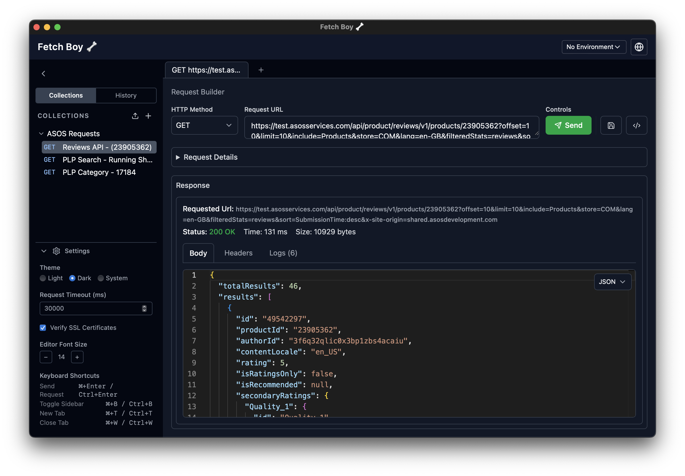
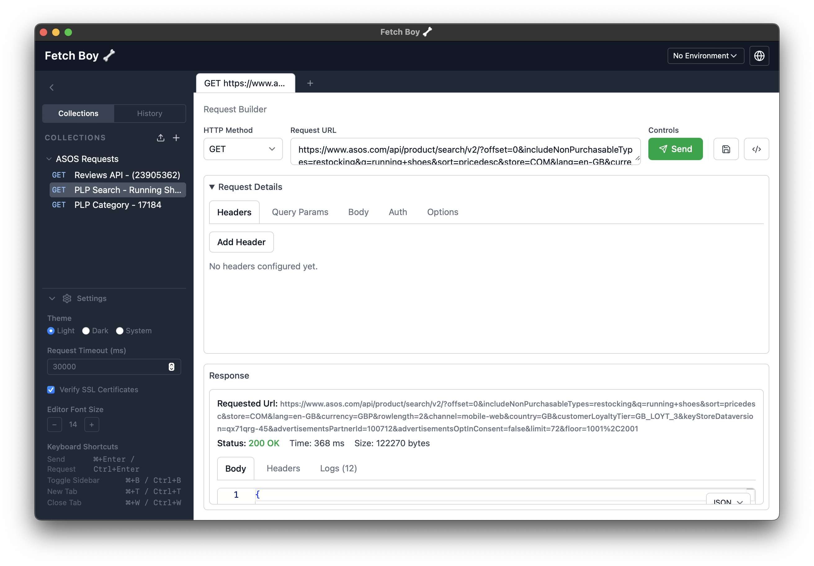

<p align="center">
  
</p>

<h1 align="left">Fetch Boy</h1>

<p align="center">
  A lightweight, open source API client built with Tauri and React. For all your rest fetching needs! 🦴
</p>

## Screenshots

<table>
  <tr>
    <td>
      
    </td>
    <td>
      
    </td>
  </tr>
</table>

A lightweight, cross-platform API client — a focused alternative to Postman that strips away enterprise complexity in favour of a clean, fast, and intuitive experience.

Runs entirely offline. No account required. All data stored locally.

---

## Features

- **Request Builder** — method selector, URL bar, headers, query params, raw body, and auth tabs
- **Monaco Editor** — syntax highlighting and JSON auto-formatting for request/response bodies
- **Collections** — tree-based sidebar with nested folders, CRUD, and drag-and-drop reordering
- **Save & Load Requests** — persist requests to collections and reload them from the sidebar
- **Request History** — auto-populated log of the last 200 sent requests
- **Tab Bar** — multi-tab workspace with inline rename, close-on-hover, and auto-label sync
- **Environments** — named key-value variable stores with `{{variable}}` interpolation at send time
- **Auth Schemes** — Bearer Token, Basic Auth, and API Key injection
- **Light / Dark / System Theme** — persisted across restarts
- **Import / Export** — collections and environments as JSON
- **Cross-platform Installers** — macOS, Windows, Linux under 15MB

---

## Architecture and Stack

| Layer            | Technology                    |
| ---------------- | ----------------------------- |
| App shell        | Tauri v2 (Rust)               |
| HTTP engine      | `reqwest` (Rust)              |
| Frontend         | React 18 + TypeScript         |
| Build tool       | Vite                          |
| Styling          | Tailwind CSS v4               |
| UI components    | shadcn/ui                     |
| State management | Zustand + Immer               |
| Local database   | SQLite via `tauri-plugin-sql` |
| Code editor      | Monaco Editor                 |
| Testing          | Vitest + Testing Library      |

The frontend lives in `fetch-boy/` (a Vite project). Tauri wraps it, exposing Rust commands (e.g. `send_request`) via the IPC bridge. All persistence is SQLite in the platform data directory.

---

## Pre-requisites

- [Node.js](https://nodejs.org/) v18+
- [Rust](https://www.rust-lang.org/tools/install) (stable toolchain)
- [Tauri CLI prerequisites](https://v2.tauri.app/start/prerequisites/) for your platform

```bash
# Install Rust
curl --proto '=https' --tlsv1.2 -sSf https://sh.rustup.rs | sh

# macOS — Xcode Command Line Tools
xcode-select --install
```

---

## Getting Started

```bash
# Clone and install
git clone <repo-url>

cd FetchBoyApp/fetch-boy

yarn install

yarn tauri dev
```

---

## Scripts

All scripts run from the `fetch-boy/` directory.

| Command              | Description                                        |
| -------------------- | -------------------------------------------------- |
| `yarn tauri dev`     | Start the app in development mode (hot-reload)     |
| `yarn tauri build`   | Build a release installer for the current platform |
| `yarn dev`           | Run the Vite frontend only (no Tauri shell)        |
| `yarn build`         | Type-check and build the frontend bundle           |
| `yarn test`          | Run the unit test suite once                       |
| `yarn test:watch`    | Run tests in watch mode                            |
| `yarn test:coverage` | Run tests with coverage report                     |
| `yarn typecheck`     | Type-check without emitting output                 |

---

## Project Structure

```
FetchBoyApp/
├── fetch-boy/              # Vite + React frontend + Tauri config
│   ├── src/                # React components, stores, hooks
│   ├── src-tauri/          # Rust source, tauri.conf.json, icons
│   └── package.json
├── _bmad-output/
│   ├── api-client-spec.md          # Full product spec
│   ├── planning-artifacts/         # Epics (epic-1 through epic-5)
│   └── implementation-artifacts/  # Stories + sprint-status.yaml
└── docs/
```

---

## Author

- **Ono**
