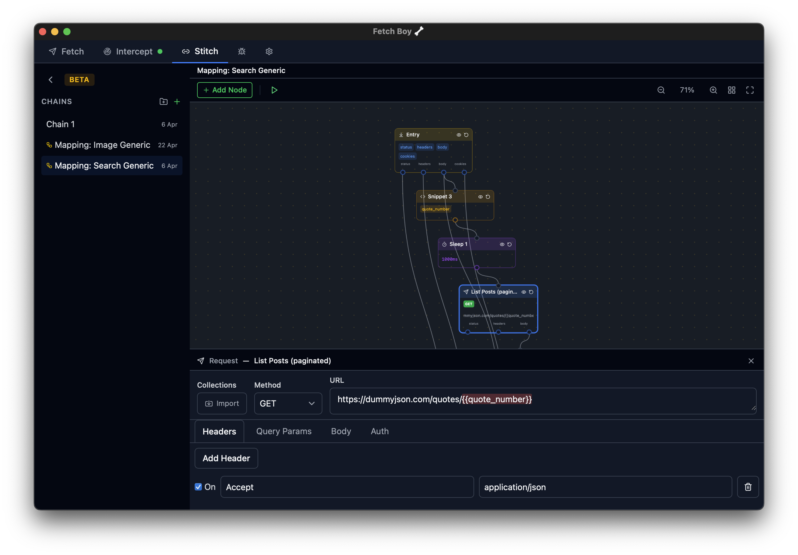

<p align="center">
  
</p>

<table>
  <tr>
    <td>
      
    </td>
    <td>
      
    </td>
    <td>
      
    </td>
  </tr>
</table>

# Fetch Boy

<p align="center">
  <a href="https://github.com/paperschool/FetchBoy/releases/latest"></a>
  
  
  
  
  <br />
  
  
  
  
  
  
</p>

A lightweight, cross-platform tool for building, intercepting, and debugging HTTP requests. Build and test APIs with a clean editor, intercept live traffic through a built-in MITM proxy, set breakpoints to inspect and modify requests in flight, use mapping rules to rewrite URLs and mock responses, and compose multi-step workflows visually with Stitch.

Runs entirely offline. No account required. All data stored locally.

---

## Contents

- [Features](#features)
- [Architecture and Stack](#architecture-and-stack)
- [Pre-requisites](#pre-requisites)
- [Getting Started](#getting-started)
- [Installation](#installation)
- [About the MITM Proxy](#about-the-mitm-proxy)
- [Known Issues](#known-issues)
- [Project Structure](#project-structure)
- [Author](#author)

---

## Features

### Request Building & Execution

- Construct HTTP requests with full control over headers, body, query parameters, and authentication
- Organize requests into collections with folders and drag-and-drop ordering
- Use environment variables with `{{variable}}` interpolation across requests
- View and edit request/response bodies in a syntax-highlighted Monaco editor
- Cancel in-flight requests and configure per-request timeouts

### HTTP Interception & Debugging

- Intercept HTTP/HTTPS traffic through a local MITM proxy
- Set breakpoints on requests and modify them before forwarding
- Inline breakpoint editing — modify status codes, headers, body, and query params directly in the detail view
- Block specific requests or simulate timeouts
- Split request/response display — intercepted requests appear immediately with a pending badge; response data fills in when it arrives
- View intercepted images inline with zoom and pan
- "Open in Fetch" button to replay any intercepted request in the request builder

### Request Mappings

- Define URL-pattern rules (exact, partial, wildcard, regex) to automatically modify proxied traffic
- Rewrite request URLs, add or remove headers, and edit cookies
- Override response bodies using the Monaco editor or serve a file from disk
- Organize mappings into folders with drag-and-drop ordering
- Auto-save changes to mapping rules with manual save fallback
- Activity log sub-tab shows which mapping rules fired for each intercepted request

### Stitch — Visual Request Chains

- Compose multi-step flows on an infinite canvas by wiring nodes together
- Node types include Request, JS Snippet, JSON Object, Sleep, Loop/forEach, Condition, Parallel + Merge, and Mapping Chain containers
- Pipe response data between nodes — outputs flow as raw types with input key shape inference and type badges
- Write inline JavaScript with a Monaco editor; console.log/warn/error is captured into the debug log
- Iterate over arrays with loop containers that auto-layout their children and indent in the debug log
- Branch on runtime conditions or fan out requests in parallel and merge their results
- Replay any node in isolation to re-run a step without rebuilding its inputs
- Node result preview with an Eye toggle; click to scroll to the corresponding debug log entry
- Import existing saved requests into the canvas via a searchable palette
- Organize chains into folders in a collapsible sidebar with auto-save
- Run chains as a pre-request step, or bind one to a mapping rule so proxied traffic triggers it automatically

### User Experience & Productivity

- Work in multiple tabs simultaneously with per-tab state isolation
- Use keyboard shortcuts (Cmd/Ctrl+Enter to send, ? for shortcuts overlay)
- Customize the application theme (light/dark/system)
- Import and export collections and environments as JSON, with post-processing options for folder merge, flatten, and depth limiting
- Keep Open checkbox keeps request editors open across tab switches
- Scripts tab with script debug output for pre/post-request hooks
- Template sidebar for dropping common request and node shapes into your work
- i18n-ready UI with `t()` migration across the app
- Guided onboarding tour on first launch covering Fetch and Intercept tabs
- "What's New" modal on version update with full changelog
- Splash screen startup animation

### History & Persistence

- View history of all sent requests with quick replay
- Automatic persistence of collections and settings to SQLite
- Certificate and system proxy installation wizard with one-click setup and full cleanup on uninstall

---

## Architecture and Stack

| Layer            | Technology                    |
| ---------------- | ----------------------------- |
| App shell        | Tauri v2 (Rust)               |
| HTTP engine      | `reqwest` (Rust)              |
| Frontend         | React 18 + TypeScript         |
| Build tool       | Vite                          |
| Styling          | Tailwind CSS v4               |
| UI components    | shadcn/ui                     |
| State management | Zustand + Immer               |
| Local database   | SQLite via `tauri-plugin-sql` |
| Code editor      | Monaco Editor                 |
| Testing          | Vitest + Testing Library      |

The frontend lives in `./` (a Vite project). Tauri wraps it, exposing Rust commands (e.g. `send_request`) via the IPC bridge. All persistence is SQLite in the platform data directory.

---

## Pre-requisites

- [Node.js](https://nodejs.org/) v18+
- [Rust](https://www.rust-lang.org/tools/install) (stable toolchain)
- [Tauri CLI prerequisites](https://v2.tauri.app/start/prerequisites/) for your platform

```bash
# Install Rust
curl --proto '=https' --tlsv1.2 -sSf https://sh.rustup.rs | sh

# macOS — Xcode Command Line Tools
xcode-select --install
```

---

## Getting Started

```bash
# Clone and install
git clone <repo-url>

cd FetchBoyApp

yarn install

yarn tauri dev
```

---

## Installation

### windows

After downloading bundle, windows defender may prompt you not to run the unsigned application, this is normal. In the "Don't Run" screen, click to see more details and then run it.

> ⚠️ **Disclaimer:** Fetch Boy is currently in **early development**. The app has not been signed or notarized by Windows App Store (or associated partners) yet, which means Windows Defender may show warnings when trying to run it. This can be bypassed as above by ignoring the warning when launching the application. Once the app reaches a more stable release, proper signing and notarization will be set up.

### macOS

After downloading or building the `.app` bundle, you may need to remove the extended attribute quarantine flag to run the app:

```bash
xattr -cr /Applications/Fetch\ Boy.app
```

Then open the app from Applications as usual.

> ⚠️ **Disclaimer:** Fetch Boy is currently in **early development**. The app has not been signed or notarized by Apple yet, which means Gatekeeper may show warnings when trying to run it. Use the `xattr` command above to bypass these restrictions. Once the app reaches a more stable release, proper signing and notarization will be set up.

### Linux

Haven't tested the builds yet, if testing please raise any issues in the issues section!

---

## About the MITM Proxy

Fetch Boy includes a built-in Man-in-the-Middle (MITM) proxy that intercepts HTTP and HTTPS traffic on your device. This is a powerful capability worth understanding before you enable it.

### What it does

When the proxy is active, Fetch Boy:

- **Generates and installs a local Certificate Authority (CA)** into your system's trust store. This allows it to decrypt HTTPS traffic passing through the proxy — the same technique used by tools like Charles Proxy, mitmproxy, and Fiddler.
- **Routes your device's HTTP/HTTPS traffic** through a local proxy server (default port 8080). It can optionally configure your system's network settings to redirect traffic automatically.
- **Can intercept, inspect, pause, modify, block, and redirect** any request or response flowing through it — via breakpoints and mapping rules you define.

In effect, the proxy turns Fetch Boy into a local networking control centre for your machine. This is by design — it's what makes the intercept, breakpoint, and mapping features work.

### Things to keep in mind

- **Only enable the proxy when you need it.** The proxy starts automatically with the app (on port 8080), but system-level proxy configuration is opt-in — your browser and other apps won't route through it unless you explicitly enable it or configure them to use it.
- **The CA certificate grants significant trust.** Any application that trusts your system certificate store will accept HTTPS certificates signed by Fetch Boy's CA. Remove the CA when you're done (`Intercept > Settings > Remove Certificate`) or when uninstalling the app.
- **Fetch Boy cleans up on exit.** The app automatically stops the proxy and reverts system proxy settings when it closes. If the app crashes or is force-killed, you may need to manually disable the system proxy in your OS network settings.
- **Don't leave the CA installed on shared or production machines.** The CA private key is stored locally in your app data directory. Anyone with access to that key could theoretically generate trusted certificates for any domain on your machine.
- **Breakpoints hold open connections.** When a breakpoint pauses a request, the upstream connection stays open until you continue, drop, or the timeout expires. Browsers may retry or abort if held too long.

### When to use it

The proxy is designed for **local development and debugging** — inspecting API calls, testing error scenarios, mocking responses, and understanding how your applications communicate over the network. It is not intended for monitoring other people's traffic or for use on networks you don't control.

---

## Known Issues

1. Intercept Server seems to indicate its still running when rebooting the app (even though it isn't)
2. UI speed seems quite sluggish on Windows 11 - Not sure why.

## Project Structure

```
FetchBoyApp/
├── ./              # Vite + React frontend + Tauri config
│   ├── src/                # React components, stores, hooks
│   ├── src-tauri/          # Rust source, tauri.conf.json, icons
│   └── package.json
```

## Author

<div align="center">

**Connect with the me:**

Dominic Jomaa • [LinkedIn](https://www.linkedin.com/in/dominicjomaa/) • [Instagram](https://www.instagram.com/ono.sendai.runner/)

</div>
